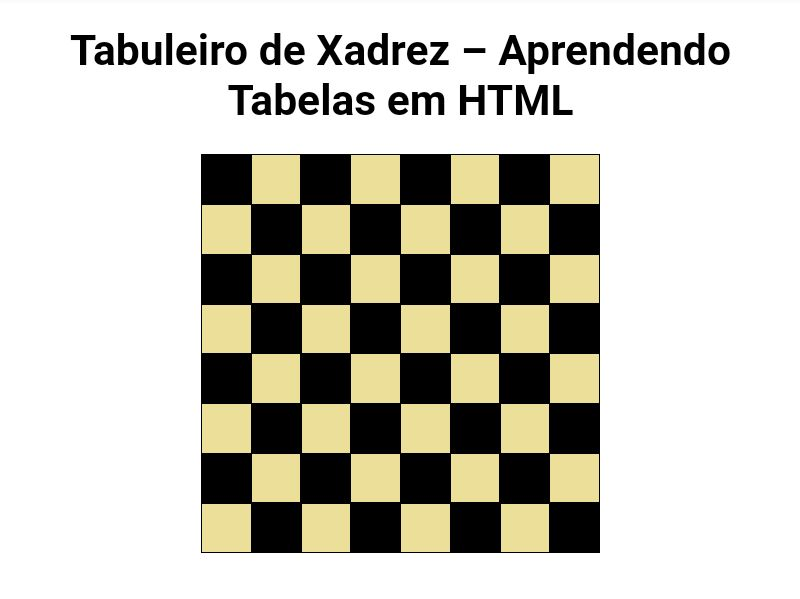

# Meu Exercício Sobre Tabelas
## 🍮 Informações
- Este é o meu primeiro exercício sobre um assunto de HTML e CSS que eu estou aprendendo que é nada mais nada menos do que *tabelas*.

- O site não passa de um exercício, então é claro que ele está *muito* simples, (não me julguem depois) isso é apenas a aplicação de um conhecimento que eu estou tendo nos meus estudos.

- <a href="https://emilsonfilho.github.io/exercicio-tabelas/tabela.html" target="_blank">Clique aqui</a> para ser redirecionado ao site no GitHub Pages 

## 🕶️ Blog e Detalhes 
Você poderá ver detalhes da construção desse projeto <a href="https://conversasetecnologia.blogspot.com/2021/12/exercicio-sobre-tabelas.html" target="_blank">Clicando Aqui</a>

## ♿ Screenshots da tela 
 

## 🎲 Tecnologias 

 

 

## 🍢 Made By

Feito com ❤️ por <a href="https://github.com/emilsonfilho/">Emilson Filho</a>

